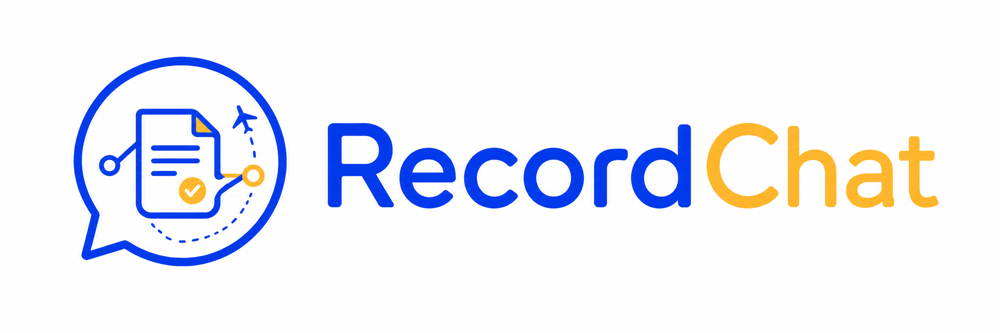
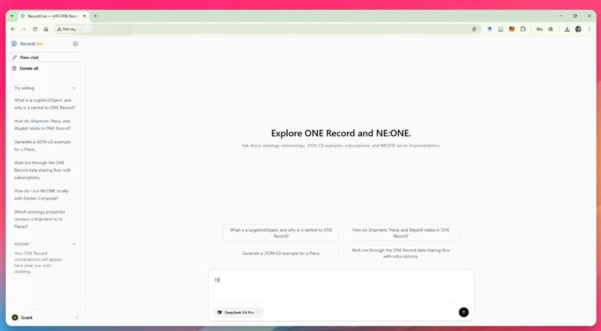
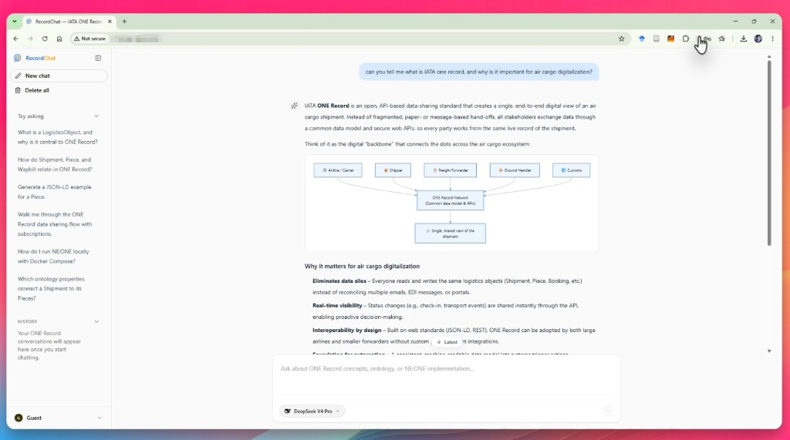
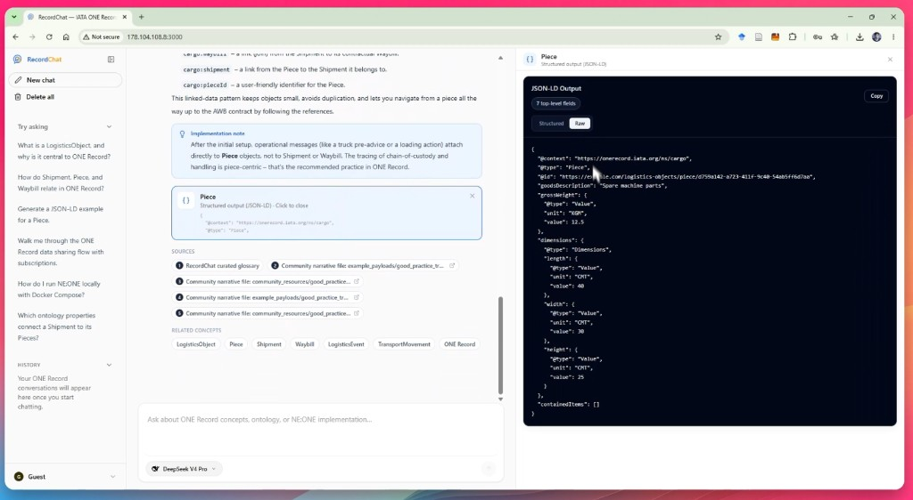
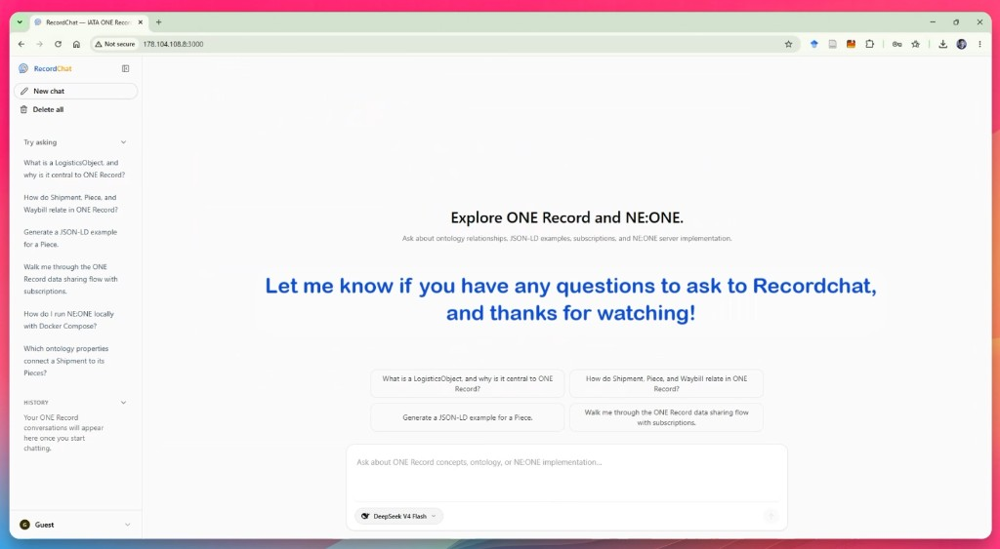

<div align="center">
  
</div>

# RecordChat

**An open-source AI assistant that makes IATA ONE Record easier to learn and explore.**

ONE Record is the air-cargo industry's data-sharing standard — powerful, but spread
across specifications, an ontology, a REST API, JSON-LD payloads, and server
implementations like **NE:ONE**. Getting up to speed means reading a lot of dense
material. RecordChat exists to shorten that path: ask a question in plain language
and get a **grounded, source-cited answer**, so developers, logistics teams, and
newcomers can understand ONE Record — including NE:ONE server topics — faster and
more easily.

It is a community helper, not a replacement for the official docs: every answer
cites where it came from, and diagrams are generated when they make a relationship
or flow clearer.

> **Disclaimer.** RecordChat is an **independent, auxiliary open-source project**.
> It is **not** an official IATA product and is not affiliated with or endorsed by
> IATA. Every reference material it uses comes from **publicly available,
> open-source resources**, and answers are retrieval-based with citations — no
> fine-tuning on third-party content.

## What it does

- **Grounded Q&A** — answers are retrieved from reviewed public sources and cited,
  not made up.
- **Concepts & ontology** — explains LogisticsObjects, classes, properties, and how
  entities relate to each other.
- **JSON-LD & API** — shows illustrative JSON-LD payloads and explains API/data-sharing flows.
- **NE:ONE implementation** — practical guidance on running and using the NE:ONE server.
- **Visual when useful** — renders Mermaid diagrams for relationships and flows.

## Screenshots

### Welcome & suggested prompts

The landing view orients new users around ONE Record topics. The sidebar lists
starter questions; the main area offers the same prompts as one-click tiles so
you can begin without typing.

<div align="center">
  
</div>

### Grounded answers with diagrams

Ask in plain language and get a cited explanation. When a relationship or flow
is easier to grasp visually, RecordChat renders a Mermaid diagram inline with
the answer.

<div align="center">
  
</div>

### JSON-LD examples, sources & related concepts

For ontology and payload questions, answers can include interactive JSON-LD
cards, a structured/raw viewer panel, source citations, and clickable related
concepts for follow-up exploration.

<div align="center">
  
</div>

### Model selection

Switch between supported LLM providers and models from the prompt bar — useful
when you want faster responses or a different reasoning style.

<div align="center">
  
</div>

## Quickstart

Requires Docker. The included `Makefile` wraps the common commands:

```bash
make env      # create .env from .env.example, then add your model API keys
make up       # start backend + frontend + Qdrant (http://localhost:3000)
make ingest   # load the public ONE Record / NE:ONE corpus into the vector store
```

Run `make` to see all targets (`down`, `restart`, `rebuild`, `logs`, `test`, …).
Generation and retrieval use external model APIs — set `LLM_*` and `EMBEDDING_*`
in `.env` before `make up`. Re-run `make ingest` whenever you change the embedding
model. See [SPEC.md](SPEC.md) for the no-Docker path and full configuration.

## Try asking

- What is a LogisticsObject, and why is it central to ONE Record?
- How do Shipment, Piece, and Waybill relate in ONE Record?
- Generate a JSON-LD example for a Piece.
- Walk me through the ONE Record data sharing flow with subscriptions.
- How do I run NE:ONE locally with Docker Compose?

## Repository layout

```
backend/    FastAPI service — API, RAG pipeline, domain layer, tests
frontend/   Next.js + Tailwind chat UI (streaming, citations, diagrams)
data/       public raw sources and processed artifacts
docs/       architecture, roadmap, data-source & compliance notes
scripts/    ingestion, evaluation, and data-governance helpers
SPEC.md     single source of truth (contracts, structure, setup)
```

## Open data & compliance

RecordChat only uses **publicly available, open-source** ONE Record, ontology, and
NE:ONE materials, with citation-first retrieval over reviewed sources. It does not
claim official affiliation, does not ingest access-restricted materials, and does
not republish raw third-party bundles. Details:
[data_compliance_report.md](docs/data_compliance_report.md) ·
[source_usage_policy.md](docs/source_usage_policy.md) ·
[data_source_plan.md](docs/data_source_plan.md).
