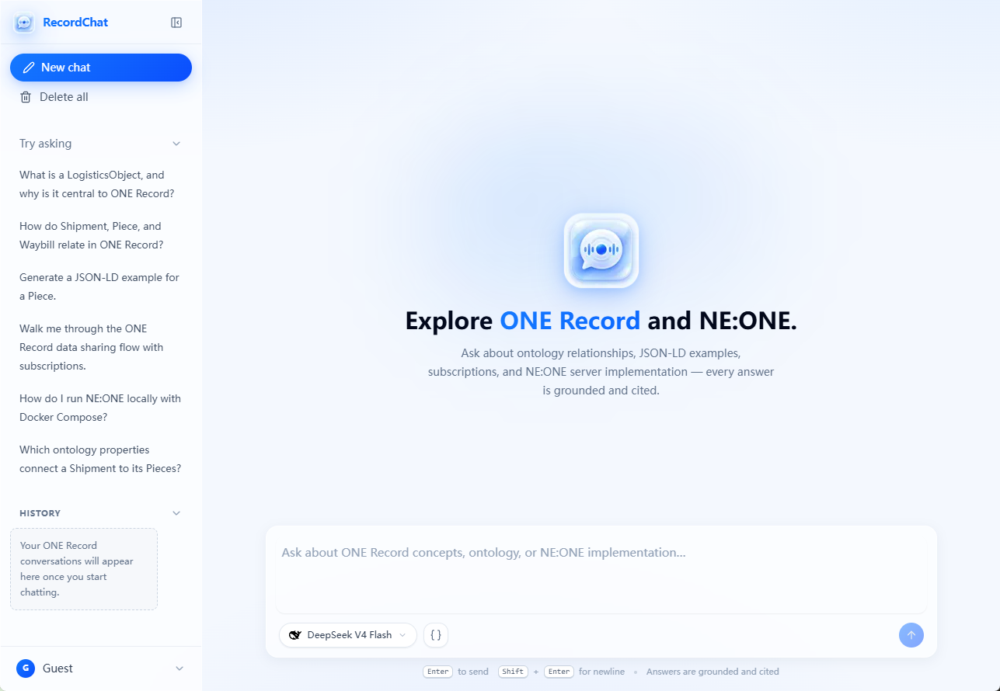

<div align="center">
  
</div>

# RecordChat

**A citation-first AI assistant for IATA ONE Record and NE:ONE.**

RecordChat helps developers and logistics teams explore the ONE Record specification, ontology, JSON-LD, APIs, and NE:ONE implementation guidance. It retrieves from reviewed public sources and returns source-linked answers; it is an **independent project, not an official IATA product**.

## What you can do

- Ask how `LogisticsObject`, `Shipment`, `Piece`, and `Waybill` relate, then inspect the supporting sources.
- Explore illustrative JSON-LD generated from templates, API flows, and NE:ONE setup questions.
- Follow a conversation through the streaming Next.js interface, with citations and diagrams when useful.

**Engineering behind the assistant:** Next.js frontend → FastAPI API and orchestration → Qdrant-backed retrieval. The repository also includes source-version governance, a versioned retrieval evaluation set, and backend tests. See the [architecture](docs/architecture.md) and [current project plan](docs/project_plan.md).

<div align="center">
  
</div>

## Run locally

Requires Docker, `make`, and API keys for the configured LLM and embedding providers.

```bash
git clone https://github.com/Jiahong-Que-9527/Recordchat.git
cd Recordchat
make env       # create .env; add LLM_* and EMBEDDING_* keys
make up        # start frontend, backend, and Qdrant
make ingest    # index reviewed public-source files into Qdrant
```

Open `http://localhost:3000` and try: **“How do Shipment, Piece, and Waybill relate?”** The corpus must be prepared before ingestion; see the [data-source guide](docs/data_download_guide.md) and [source-usage policy](docs/source_usage_policy.md). Configuration and API details are in [SPEC.md](SPEC.md).

## Scope and limits

RecordChat is a local/demo-oriented application, not a hosted production service. Citations make answers inspectable, not automatically correct; verify important claims against the linked source. Generated JSON-LD is illustrative and is **not** automatically written to a ONE Record Server. RecordForge is an optional connector when configured; a live aviation lakehouse integration is not part of the current application.

Only reviewed, publicly accessible sources should be ingested. The project does not claim IATA affiliation or redistribute third-party source bundles. See [data compliance notes](docs/data_compliance_report.md) for the source boundaries.
