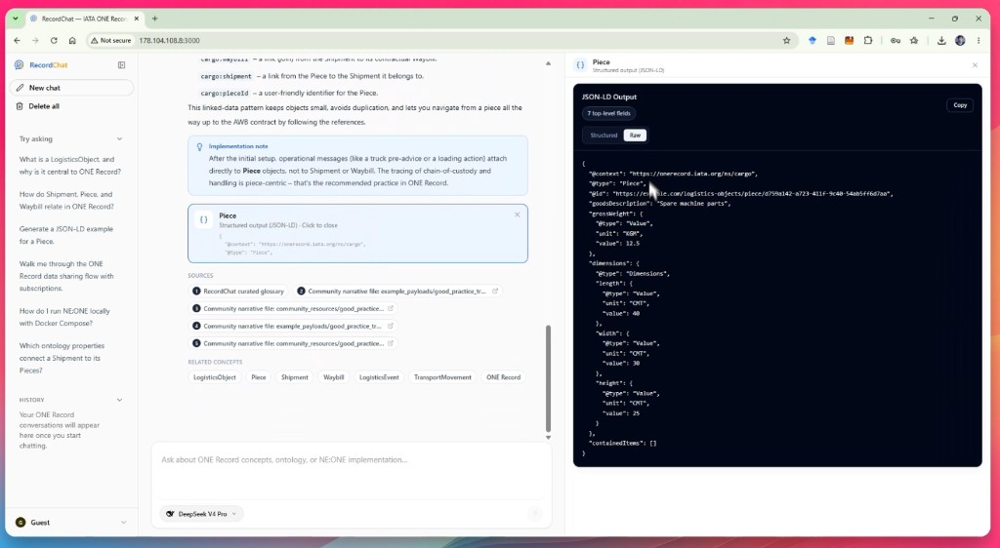

<p align="center"></p>

<h1 align="center">RecordChat</h1>

<p align="center"><strong>A citation-first AI assistant for IATA ONE Record and NE:ONE</strong></p>

[Quick start](#run-locally) · [Architecture](docs/architecture.md) · [Source policy](docs/source_usage_policy.md) · [Project status](docs/project_plan.md)

Air-cargo teams adopting ONE Record must navigate specifications, an ontology, JSON-LD payloads, APIs, and server guidance. RecordChat turns that fragmented documentation into a **question-and-answer interface with inspectable sources**. It helps developers and logistics practitioners understand the standard, but does not replace the standard or make operational decisions for them.

RecordChat is an **independent public project**, not an official IATA product or an IATA-endorsed service.

## What it helps with

| Question | What RecordChat provides |
|---|---|
| “How do `Shipment`, `Piece`, and `Waybill` relate?” | A source-linked explanation of concepts and ontology relationships, with related terms for follow-up. |
| “What might a `Piece` look like in JSON-LD?” | An illustrative, template-generated JSON-LD example beside the explanation and sources. |
| “How does NE:ONE work?” | Retrieval over reviewed public implementation guidance, with citations back to the relevant material. |

<p align="center">
  
</p>

The screenshot shows the useful distinction: **an answer, the sources behind it, and a structured example are separate things a reader can inspect**. Another [interface view](assets/welcome_pic2.png) shows the suggested starting questions.

## How it is engineered

```text
Next.js chat UI → FastAPI API → query classification / retrieval → Qdrant + reviewed sources
                                ↓
                  cited answer · related concepts · optional JSON-LD / diagram
```

- **Source governance:** ingestible public files have provenance metadata; a canonical-version rule avoids mixing conflicting live versions of the ontology, API description, and documentation. Staging and access-restricted material are not part of the indexed corpus. See the [source plan](docs/data_source_plan.md) and [usage policy](docs/source_usage_policy.md).
- **Retrieval quality:** vector and lexical candidates, query-aware filtering/reranking, follow-up context, and a citation filter are implemented behind the FastAPI service. The [versioned evaluation questions](data/eval/questions.yaml) and [project plan](docs/project_plan.md) make retrieval behavior reviewable rather than relying only on a polished demo.
- **Structured output:** JSON-LD structure comes from application templates, not free-form LLM generation. An optional RecordForge connector can show a structured workflow result when configured; an unconfigured or unavailable connector reports that state rather than silently succeeding.
- **Application boundaries:** the Next.js interface streams responses and displays citations, diagrams, JSON-LD, and workflow status. The repository includes backend tests and source-governance checks; it does not claim a production SLA.

The code is organized under [`backend/`](backend/), [`frontend/`](frontend/), and [`scripts/`](scripts/); the [architecture](docs/architecture.md) explains the component contracts. The [demo script](docs/demo_script.md) contains prompts for a focused walkthrough.

## Run locally

Requires Docker, `make`, and API keys for the selected LLM and embedding providers. Prepare the reviewed public-source corpus using the [data-source guide](docs/data_download_guide.md) before ingestion.

```bash
git clone https://github.com/Jiahong-Que-9527/Recordchat.git
cd Recordchat
make env       # create .env; add LLM_* and EMBEDDING_* keys
make up        # start frontend, backend, and Qdrant
make ingest    # index the prepared, reviewed corpus
```

Open `http://localhost:3000` and ask: **“How do Shipment, Piece, and Waybill relate in ONE Record?”** Then inspect the cited sources. See [SPEC.md](SPEC.md) for configuration and API contracts.

## Scope and limitations

- This is a **local/demo-oriented application**, not a hosted production service. Source citations make a response inspectable, **not automatically correct**; verify important claims against the source.
- Generated JSON-LD is illustrative. RecordChat does **not** automatically write objects to a ONE Record Server. Its aviation-lakehouse content is explanatory, not a live lakehouse integration.
- Only reviewed, publicly accessible materials should be ingested. The project does not redistribute raw third-party document bundles or claim official IATA affiliation. See [data compliance notes](docs/data_compliance_report.md).
